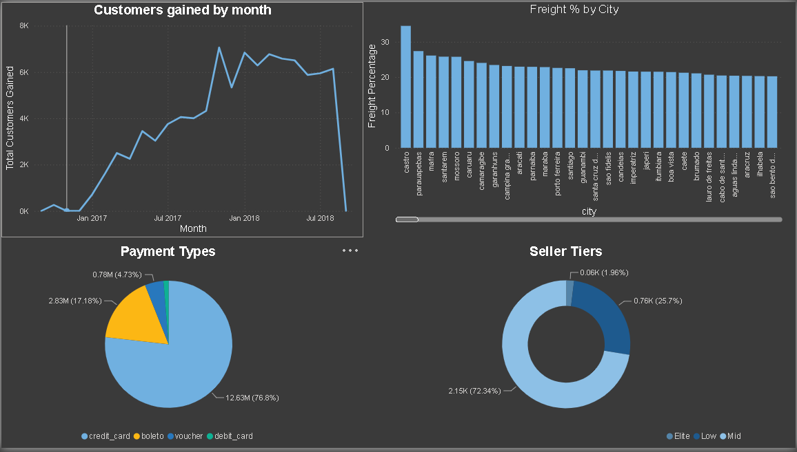
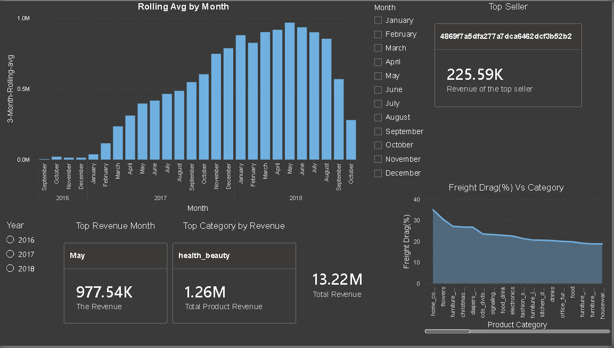

# 🛍️ Olist E-Commerce End-to-End Analytics Pipeline

An end-to-end data analytics project that transforms raw transactional marketplace data into actionable business insights — spanning **Python** data preparation, **MySQL** schema design & analytics, and an interactive **Power BI** dashboard.

---

## 📂 Repository Structure

```text
├── data_preparation/           # Python cleaning & encoding scripts
│   ├── encoding_fix.py
│   ├── handling_na.py
│   ├── standardize_column_names.py
│   └── requirements.txt
│
├── sql_analytics/              # Chronological analytical SQL scripts (00 → 10)
│   ├── 00_create_tables.sql
│   ├── 01_loading_data.sql
│   └── ...
│
└── dashboards/                 # Power BI dashboard files (.pbix)
```

---

## ⚙️ How to Setup & Replicate

### 1. Clone the Repository
```bash
git clone https://github.com/Dhanush-K249/olist-ecommerce-analytics.git
cd olist-ecommerce-analytics
```

### 2. Download the Dataset
Download the **Brazilian E-Commerce Public Dataset by Olist** from Kaggle:
🔗 [olistbr/brazilian-ecommerce](https://www.kaggle.com/datasets/olistbr/brazilian-ecommerce)

Unzip all **9 raw `.csv` files** and place them inside a local `/data/` folder in your project root.

### 3. Run Python Data Preparation
```bash
pip install -r data_preparation/requirements.txt

python data_preparation/encoding_fix.py
python data_preparation/handling_na.py
python data_preparation/standardize_column_names.py
```

### 4. Setup MySQL Database & Load Data
1. Open **MySQL Workbench** (or your preferred SQL terminal).
2. Execute `sql_analytics/00_create_tables.sql` to create the database and build the table schemas.
3. Execute `sql_analytics/01_loading_data.sql` to bulk-load your cleaned CSV files into the tables.

### 5. Execute the Analytics Pipeline
Run the numbered analytical scripts sequentially (`02_` → `10_`) inside `sql_analytics/` to generate:
- Cohort retention matrices
- Rolling revenue averages
- Key KPI metrics

Then open `dashboards/sql.pbix` in **Power BI Desktop** and update the database connection settings to point to your local MySQL instance to view the live dashboard.

---

## 📊 Power BI Executive Dashboard



